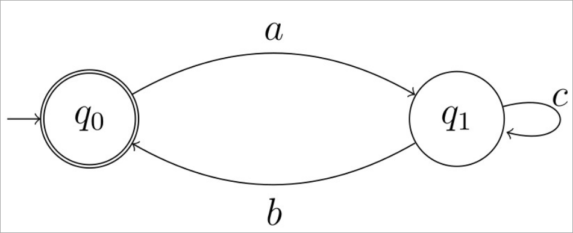
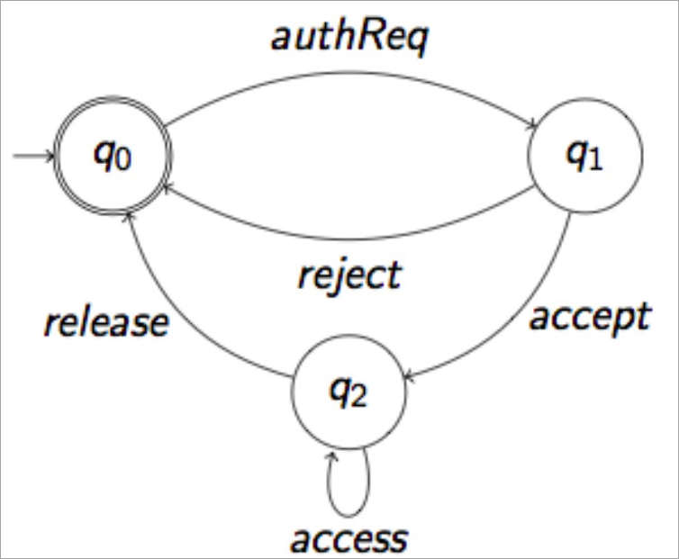
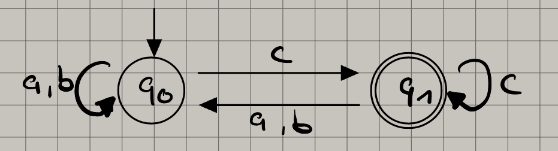

# Sebastian Mohr - 23141808

## a

$$
\omega = (ac * b)^\omega
$$

It's an infinite loop, that can starts with the $a$ transformation.
Afterwards it can revolve around $c$ or take path $b$,
which brings it back to the state where the next transformation is $a$.

## b

$$
\omega =
 (authReq ((accept access * release) + reject))^\omega
$$

To reach the accepted state $q_0$, the automaton can take 3 different paths:

1. 0 transitions, start state is accepted state.
1. The transition goes to $q_1$ and back to $q_0$, with $authReq$ and $reject$ each executing once.
1. The transition goes to $q_1$ with transition $authReq$.
   Afterwards it reaches $q_2$ by executing $accept$ once, then $access$ $0 - \infty$ times.
   Executes $release$ once to reach final state $q_0$.

The automaton is a loop, which means it can execute infinite times.

## c

The automaton accepts $\omega = (a * b * c)^\omega$, which translates to:

- $0 - \infty$ times $a$
- $0 - \infty$ times $b$
- exactly 1 times $c$

This process can loop inifinite times, that means that the accepting state always has to have a $c$ leading to it.

## d

The automaton accepts $\omega = (a * b * c)^\omega$, which translates to:

- 0 - $\infty$ times $a$
- 0 - $\infty$ times $b$
- exactly 1 times $c$

This process can loop inifinite times, that means that the accepting state always has to have a $c$ leading to it.

## e

## f

## g
