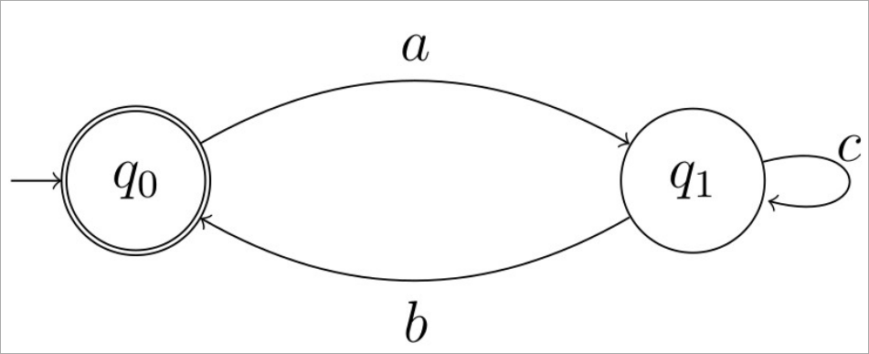
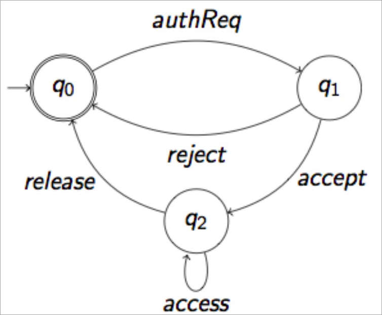
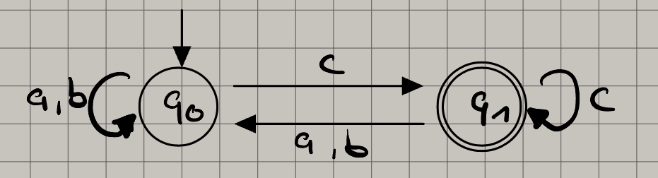
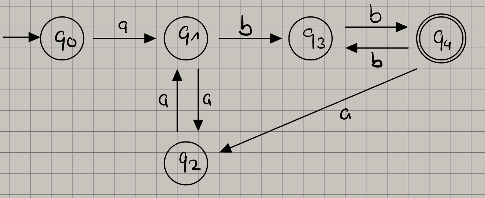
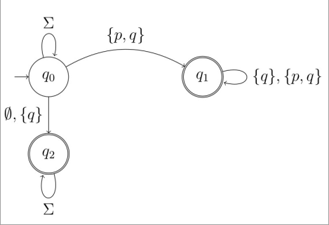
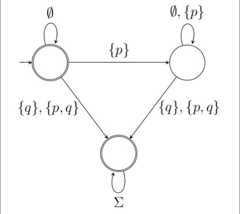
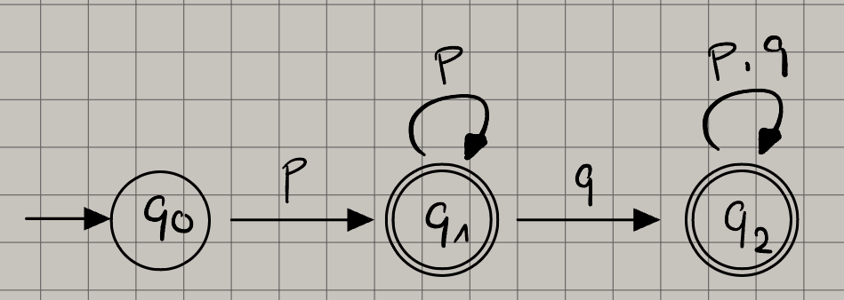

# Sebastian Mohr - 23141808 - Part II

## a

$$
\omega = (ac * b)^\omega
$$

It's an infinite loop, that can starts with the $a$ transformation.
Afterwards it can revolve around $c$ or take path $b$,
which brings it back to the state where the next transformation is $a$.

## b

$$
\omega =
 \emptyset +
 (
    (authReq (accept access * release)) +
    (authReq reject)
 )^\omega
$$

To reach the accepted state $q_0$, the automaton can take 3 different paths:

1. 0 transitions, start state is accepted state.
1. The transition goes to $q_1$ and back to $q_0$, with $authReq$ and $reject$ each executing once.
1. The transition goes to $q_1$ with transition $authReq$.
   Afterwards it reaches $q_2$ by executing $accept$ once, then $access$ $0 - \infty$ times.
   Executes $release$ once to reach final state $q_0$.

The automaton is a loop, which means it can execute infinite times.

## c

The automaton accepts $\omega = (a * b * c)^\omega$, which translates to:

- $0 - \infty$ times $a$
- $0 - \infty$ times $b$
- exactly 1 times $c$

This process can loop inifinite times, that means that the accepting state always has to have a $c$ leading to it.

## d

The automaton accepts $\omega = a ((a a) * b b)^\omega$, which translates to:

- exactly 1 $a$
- and then looping the following:
  - 0 - $\infty$ times $a$ and $a$
  - exactly 1 times $b$ and $b$

## e

LTL-formula: $F\ (p \rightarrow G\ q)$

Alphabet: $\sum := \{\emptyset, \{p\}, \{q\}, \{p, q\} \}$

The given LTL-formula means: in the _Future_ $p$ leads to _Globally_ $q$ being true

As the automaton switches to the accepted state $q_1$ when executing $p$,
there is a path that proves the LTL-formula.

Also the automaton can switch to accepted state $q_2$ when executing $q$ first.
There the entire alphabet loops over the state, so the LTL-formula can also be proved.

**That means, that the Büchi automaton accepts the runs staisfying the LTL-formula.**

## f

Alphabet: $\sum := 2^{\{p, q\}}$

LTL-formula: $(\emptyset) \lor G\ ((p \lor \emptyset)\ U\ (q \lor \{p, q\}))$

There are 2 different ways to reach an accepted state in this automaton:

- The automaton accepts $\emptyset$, which means it already starts in an accepting state.
- The automaton accepts only $p$ or $\emptyset$, until at least one $q$ or $\{p, q\}$ is put in.
  Afterwards the entire alphabet is staying in the accepted state.

## g

The automaton accepts $G\ p \lor F\ ( p \land q )$, which translates to:

- _Globally_ $p$ is true, **OR**
- in the _Future_ $p$ **AND** $q$ are true
